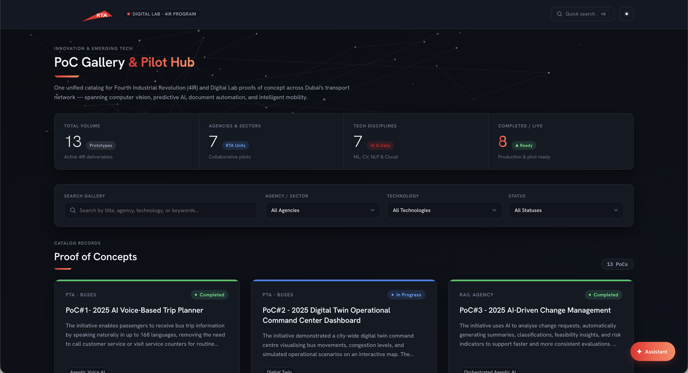
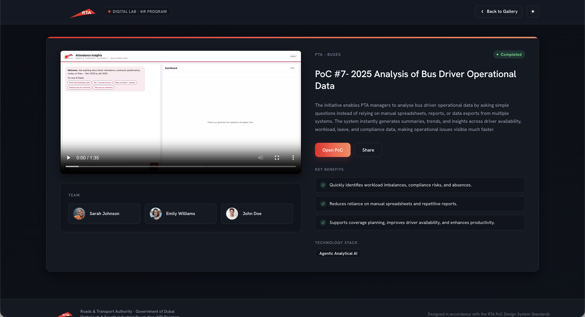

# Digital Lab PoC Gallery

A modern, responsive web application for discovering, filtering, and viewing Proofs of Concept (PoCs) developed across Digital Lab and associated agencies.

The application provides a centralized interface for browsing technology-focused PoCs, viewing detailed information, accessing demonstration videos, sharing individual PoCs, and retrieving deliverable information through the Digital Lab LabPortal API.

> **Current Version:** Production-ready internal release using a Dockerized Nginx + FastAPI architecture with Redis caching.

---
# Screenshots

## Main Page


## PoC Details


---

# Overview

The Digital Lab PoC Gallery provides a centralized platform for showcasing and accessing Proofs of Concept.

Users can:

* Browse available PoCs
* Search PoCs by title, description, or agency
* Filter PoCs by agency
* Filter PoCs by technology
* Filter PoCs by status
* View detailed PoC information
* View benefits and technology stacks
* View associated team members
* Watch PoC demonstration videos
* Share individual PoCs through unique URLs
* Open a PoC directly using a shared URL
* Navigate to external PoC resources
* Retrieve deliverable information through the backend API
* Cache frequently requested API data using Redis

The application uses a lightweight dependency-free frontend and a Python/FastAPI backend responsible for API communication, caching, error handling, and media proxying.

---

# Features

## PoC Gallery

PoCs are presented as responsive cards containing:

* Agency
* PoC title
* Description
* Status
* Technology stack
* Team size
* View Details action

The gallery automatically adapts to different screen sizes.

### Status Indicators

Each PoC includes a status indicator represented through a badge and visual status bar.

Supported statuses include:

* Planning
* In Progress
* Complete
* Completed
* Blocked

---

# Search

The gallery provides dynamic search functionality across:

* PoC title
* PoC description
* Agency

Search results update as the user enters text.

---

# Filtering

The gallery provides multiple filtering mechanisms.

## Agency Filter

Users can filter PoCs by the organization or agency responsible for the PoC.

## Technology Filter

Technology filtering supports multiple simultaneous selections.

For example:

```text
Python
FastAPI
React
AI
Machine Learning
GIS
```

A PoC is returned when it contains at least one of the selected technologies.

## Status Filter

Users can filter PoCs based on their current status.

---

# PoC Details

Selecting **View Details** opens the detailed PoC interface.

The details view can contain:

* Status
* Agency / Department
* Title
* Description
* External PoC link
* Share action
* Demonstration video
* Benefits
* Technology stack
* Team members

The interface is responsive across desktop, tablet, and mobile devices.

---

# Demonstration Videos

PoC demonstration videos can be provided through the backend API.

The application supports both locally hosted development videos and videos retrieved through the backend media proxy.

Example local development video:

```text
assets/video/poc1.mp4
```

Backend video endpoint:

```text
/api/deliverables/{id}/demo-video
```

If a demonstration video cannot be loaded, the frontend displays an appropriate video placeholder.

---

# Sharing PoCs

Each PoC can be accessed directly using its unique identifier.

Example:

```text
poc.html?id=7
```

When a shared URL is opened, the application:

1. Reads the PoC ID from the URL
2. Requests the corresponding deliverable
3. Loads the PoC information
4. Displays the requested PoC

The **Share** action copies the current PoC URL to the clipboard.

This allows individual PoCs to be shared directly without requiring users to manually search for them.

---

# Backend API

The application includes a Python/FastAPI backend.

The backend is responsible for:

* Retrieving deliverable information
* Retrieving individual deliverable details
* Communicating with the Digital Lab LabPortal API
* Proxying demonstration videos
* Caching frequently requested API responses
* Returning structured API responses to the frontend
* Handling external API failures and errors

The backend is located under:

```text
backend/
```

---

# Redis Caching

Redis is used as the centralized application caching layer.

The cache reduces unnecessary requests to the external LabPortal API and improves response times for frequently accessed resources.

The request flow is:

```text
Frontend
    │
    ▼
 FastAPI
    │
    ▼
 Redis
    │
 ├── HIT ──────────► Return Cached Data
 │
 └── MISS
        │
        ▼
   LabPortal API
        │
        ▼
      Redis
        │
        ▼
     Response
```

## Why Redis?

A process-local memory cache becomes problematic when multiple backend instances are running because each instance maintains its own cache.

For example:

```text
FastAPI #1 ── Local Cache
FastAPI #2 ── Local Cache
FastAPI #3 ── Local Cache
```

Redis provides a shared caching layer:

```text
                 Redis
              Shared Cache
                   │
       ┌───────────┼───────────┐
       │           │           │
       ▼           ▼           ▼
  FastAPI #1  FastAPI #2  FastAPI #3
```

This allows multiple backend instances to share cached API responses.

## Cache Strategy

The application uses a TTL-based caching strategy.

The current cache duration is approximately:

```text
5 minutes
```

Example cache keys include:

```text
deliverables:all
deliverable:{id}
```

The exact key structure can be extended as additional API resources are introduced.

---

# Architecture

The application consists of three Dockerized services:

```text
                         ┌─────────────────────┐
                         │        User         │
                         └──────────┬──────────┘
                                    │
                                    ▼
                         ┌─────────────────────┐
                         │       Nginx         │
                         │   Frontend Server   │
                         │      Port 80        │
                         └──────────┬──────────┘
                                    │
                                    ▼
                         ┌─────────────────────┐
                         │      FastAPI        │
                         │       Backend       │
                         │      Port 8000      │
                         └──────────┬──────────┘
                                    │
                         ┌──────────┴──────────┐
                         │                     │
                         ▼                     ▼
                  ┌──────────────┐      ┌──────────────┐
                  │    Redis     │      │  LabPortal   │
                  │    Cache     │      │     API      │
                  └──────────────┘      └──────────────┘
```

The frontend communicates with FastAPI through Nginx.

FastAPI communicates with:

* Redis for caching
* LabPortal for external deliverable data

Redis remains internal to the Docker network.

---

# Docker Architecture

The project is containerized using Docker Compose.

## Frontend Container

The frontend container runs Nginx.

Responsibilities:

* Serve HTML
* Serve CSS
* Serve JavaScript
* Serve images
* Serve videos
* Serve JSON assets
* Proxy `/api/` requests to FastAPI

The application is exposed through:

```text
http://localhost
```

## Backend Container

The backend container runs FastAPI using Uvicorn.

Responsibilities:

* Provide REST API endpoints
* Communicate with LabPortal
* Communicate with Redis
* Cache API responses
* Proxy demonstration videos
* Handle API errors

FastAPI listens internally on:

```text
0.0.0.0:8000
```

The backend is not directly exposed to the host in the Docker configuration.

## Redis Container

The Redis container provides centralized application caching.

Responsibilities:

* Store cached API responses
* Share cache data between backend instances
* Reduce external API requests
* Improve response latency
* Provide a foundation for horizontal backend scaling

Redis listens internally on:

```text
6379
```

Redis should remain internal to the application network.

---

# Nginx API Proxy

The frontend uses relative API URLs rather than hardcoding backend hostnames or ports.

Example:

```javascript
const API_BASE_URL = "";
```

A frontend request such as:

```text
/api/deliverables/7
```

is proxied by Nginx to:

```text
http://backend:8000/api/deliverables/7
```

This allows the frontend and backend to operate behind a single public endpoint while keeping the backend service internal.

---

# Technology Stack

## Frontend

| Technology | Purpose                              |
| ---------- | ------------------------------------ |
| HTML5      | Page structure                       |
| CSS3       | Styling and responsive layout        |
| JavaScript | Application logic                    |
| JSON       | Local/static data                    |
| Dubai Font | UI typography                        |
| Nginx      | Static file server and reverse proxy |

The frontend does not require a frontend framework or package manager.

## Backend

| Technology    | Purpose                   |
| ------------- | ------------------------- |
| Python        | Backend language          |
| FastAPI       | REST API framework        |
| Pydantic      | Data validation           |
| HTTPX         | HTTP communication        |
| python-dotenv | Environment configuration |
| Uvicorn       | ASGI server               |

## Infrastructure

| Technology     | Purpose                           |
| -------------- | --------------------------------- |
| Docker         | Containerization                  |
| Docker Compose | Service orchestration             |
| Nginx          | Frontend server and reverse proxy |
| Redis          | Shared application cache          |

---

# Project Structure

```text
DDL-POC-WEB/

├── README.md
├── Dockerfile
├── docker-compose.yml
├── nginx.conf
│
├── assets/
│   ├── favicon.png
│   ├── font/
│   │   ├── Dubai-Bold.ttf
│   │   ├── Dubai-Light.ttf
│   │   ├── Dubai-Medium.ttf
│   │   └── Dubai-Regular.ttf
│   ├── images/
│   ├── video/
│   │   └── poc1.mp4
│   └── logo.png
│
├── backend/
│   ├── Dockerfile
│   ├── requirements.txt
│   └── app/
│       ├── __init__.py
│       ├── main.py
│       └── deliverables/
│           ├── __init__.py
│           └── router.py
│
├── css/
│   ├── poc.css
│   └── style.css
│
├── data/
│   └── pocs.json
│
├── js/
│   ├── app.js
│   └── poc.js
│
├── index.html
└── poc.html
```

---

# Data Structure

Local development data is stored in:

```text
data/pocs.json
```

A PoC follows the general structure:

```json
{
    "id": 1,
    "title": "Example PoC",
    "agency": "Digital Lab",
    "status": "In Progress",
    "description": "Short description of the PoC.",
    "fullDescription": "Detailed description of the PoC.",
    "technologies": [
        "Python",
        "FastAPI"
    ],
    "benefits": [
        "Improves efficiency",
        "Reduces manual work"
    ],
    "team": [
        {
            "name": "John Doe",
            "role": "Developer"
        }
    ],
    "link": "https://example.com"
}
```

Production deliverable information can be retrieved from the backend API.

---

# Running the Project

## Docker — Recommended

From the project root:

```bash
docker compose build
```

Start the application:

```bash
docker compose up
```

Or run in detached mode:

```bash
docker compose up -d
```

The frontend will be available at:

```text
http://localhost
```

Stop the application:

```bash
docker compose down
```

To rebuild after making changes:

```bash
docker compose down
docker compose build
docker compose up
```

---

# Backend Environment Variables

The backend uses environment variables for configuration.

Example:

```text
LABPORTAL_API_KEY=your_api_key_here
REDIS_URL=redis://redis:6379
```

Credentials must not be committed to the repository.

For production deployments, secrets should be managed using the deployment environment's secret management system.

---

# Running Without Docker

Docker is recommended for the complete application, but the frontend and backend can also be run independently during development.

## Frontend

Because the frontend uses `fetch()` to load resources, it should be served through a local HTTP server rather than opened using `file://`.

From the project root:

```bash
python3 -m http.server 8000
```

Then open:

```text
http://localhost:8000
```

## Backend

Navigate to the backend:

```bash
cd backend
```

Create a virtual environment:

```bash
python3 -m venv venv
```

### macOS / Linux

```bash
source venv/bin/activate
```

### Windows

```powershell
venv\Scripts\activate
```

Install dependencies:

```bash
pip install -r requirements.txt
```

Start FastAPI:

```bash
uvicorn app.main:app --reload
```

The backend will normally be available at:

```text
http://127.0.0.1:8000
```

Interactive API documentation:

```text
http://127.0.0.1:8000/docs
```

---

# API Endpoints

The backend exposes deliverable-related endpoints under:

```text
/api/deliverables/
```

Examples:

```text
GET /api/deliverables
```

```text
GET /api/deliverables/{id}
```

```text
GET /api/deliverables/{id}/demo-video
```

The implementation is located in:

```text
backend/app/deliverables/router.py
```

FastAPI automatically provides interactive documentation through:

```text
/docs
```

---

# External LabPortal Integration

The backend communicates with the Digital Lab LabPortal API to retrieve deliverable information.

The backend acts as an intermediary between the frontend and LabPortal:

```text
Frontend
    │
    ▼
 FastAPI
    │
    ├────────► Redis
    │
    └────────► LabPortal API
```

This architecture keeps the LabPortal API key server-side rather than exposing it to frontend users.

---

# UI Design

The interface follows a modern government digital portal aesthetic inspired by RTA-style digital interfaces.

Design principles include:

* Clean
* Professional
* Accessible
* Responsive
* Information-focused
* Modern
* Government-oriented

The application uses the RTA-inspired visual language selectively throughout the interface.

## Color System

```text
RTA Blue       #191C84
RTA Blue Hover #13166E
RTA Red        #D23527
RTA Yellow     #FDB813
RTA Green      #00AF54
RTA Purple     #6F2D91
RTA Cyan       #00B4BD
Black          #000000
```

---

# Typography

The application uses the locally hosted Dubai font family.

Font files are located under:

```text
assets/font/
```

Available weights:

```text
Dubai Light     → 300
Dubai Regular   → 400
Dubai Medium    → 500
Dubai Bold      → 700
```

Using local font files avoids dependency on external font providers and provides consistent typography in restricted network environments.

---

# Responsive Design

The gallery supports desktop, tablet, and mobile layouts.

### Desktop

Three cards per row.

### Tablet

Two cards per row.

### Mobile

One card per row.

The PoC details interface also adapts to smaller screen sizes.

---

# Accessibility

The application includes several accessibility considerations.

## Keyboard Navigation

Interactive interfaces support keyboard navigation including:

```text
Escape
Tab
Shift + Tab
```

`Escape` can be used to close the details interface where applicable.

## Focus Management

Focus is managed when opening and closing interactive UI elements.

## Reduced Motion

The application respects:

```css
prefers-reduced-motion
```

Users who have reduced-motion preferences enabled receive reduced animations and transitions.

---

# Security Considerations

The application includes several security measures.

Dynamic data is escaped before being inserted into HTML using:

```javascript
escapeHTML()
```

and:

```javascript
escapeAttribute()
```

External links opened in new tabs use:

```html
target="_blank"
rel="noopener noreferrer"
```

Backend credentials are supplied through environment variables rather than frontend code.

The LabPortal API key is therefore kept server-side.

Redis remains internal to the Docker network and is not intended to be publicly exposed.

---

# Browser Support

The application uses modern browser APIs including:

* Fetch API
* URLSearchParams
* Clipboard API
* ES6 JavaScript
* HTML5 video

Recommended browsers:

* Google Chrome
* Microsoft Edge
* Safari
* Firefox

---

# Development

## Adding a New PoC

For locally managed PoC data, add a new object to:

```text
data/pocs.json
```

The gallery automatically uses the available PoC information when rendering the interface.

Where applicable, production information is retrieved from the backend API.

---

# Main Frontend Files

## `index.html`

Defines the main PoC Gallery page structure.

## `poc.html`

Defines the PoC detail page structure.

## `js/app.js`

Contains primary gallery functionality including:

* Loading PoC data
* Rendering cards
* Search
* Filtering
* Technology multi-select
* Details management
* Sharing
* URL-based navigation
* Team rendering

## `js/poc.js`

Contains PoC detail functionality including:

* Loading individual deliverables
* Rendering PoC details
* Video handling
* Team rendering
* Benefits rendering
* Technology rendering
* Sharing
* Error handling

## `css/style.css`

Contains primary gallery styling.

## `css/poc.css`

Contains PoC detail page styling.

---

# Docker Files

## `Dockerfile`

Builds the frontend container and packages the static website with Nginx.

## `backend/Dockerfile`

Builds the FastAPI backend container.

## `docker-compose.yml`

Defines and orchestrates:

* Frontend
* Backend
* Redis

## `nginx.conf`

Configures Nginx to:

* Serve the frontend
* Serve static assets
* Proxy `/api/` requests to FastAPI

---

# Production Architecture

The current architecture can be extended for larger deployments.

A scalable deployment can introduce a load balancer and multiple FastAPI instances:

```text
                         Users
                           │
                           ▼
                    ┌───────────────┐
                    │ Load Balancer │
                    └───────┬───────┘
                            │
             ┌──────────────┼──────────────┐
             │              │              │
             ▼              ▼              ▼
        FastAPI #1     FastAPI #2     FastAPI #3
             │              │              │
             └──────────────┼──────────────┘
                            │
                            ▼
                    ┌───────────────┐
                    │     Redis     │
                    │ Shared Cache  │
                    └───────┬───────┘
                            │
                            ▼
                     LabPortal API
```

Redis allows multiple backend instances to share cached data.

Future infrastructure can introduce:

* Load balancing
* HTTPS/TLS
* Secure secret management
* Authentication and authorization
* Rate limiting
* Centralized logging
* Error monitoring
* Health checks
* Container resource limits
* Redis high availability
* Database-backed storage
* Automated testing
* CI/CD
* Backup and recovery
* Monitoring and observability

These components are infrastructure considerations for larger production deployments rather than requirements of the current release.

---

# Current Scope

The current release focuses on the core PoC discovery and deliverable experience.

Included:

* PoC Gallery
* Search
* Agency filtering
* Technology filtering
* Status filtering
* PoC details
* Team information
* Benefits
* Demonstration videos
* PoC sharing
* URL-based navigation
* External resource links
* Analytics
* LabPortal API integration
* FastAPI backend
* Redis caching
* Docker deployment
* Nginx reverse proxy

AI functionality is outside the scope of the current release.

Potential future functionality such as AI-powered chat, summaries, recommendations, and risk assessment can be implemented as separate backend services without requiring a redesign of the core gallery architecture.

---

# License

This project is intended for internal use.

Unless otherwise specified, project code, data, assets, and documentation are proprietary and should not be redistributed or used outside the intended organization without authorization.

---

# Project Information

| Field            | Details                                              |
| ---------------- | ---------------------------------------------------- |
| **Project**      | Digital Lab PoC Gallery                              |
| **Author**       | Jishnu Setia                                         |
| **Role**         | AI & Machine Learning Intern                         |
| **Organization** | Digital Lab Technology                               |
| **Purpose**      | Centralized gallery for showcasing Proofs of Concept |
| **Architecture** | Dockerized Nginx + FastAPI + Redis                   |
| **Frontend**     | HTML5 + CSS3 + JavaScript                            |
| **Backend**      | Python + FastAPI                                     |
| **Caching**      | Redis                                                |
| **External API** | Digital Lab LabPortal                                |
| **Deployment**   | Docker Compose                                       |
| **Status**       | Completed                                            |

> This project is intended for internal use by Digital Lab Technology.
